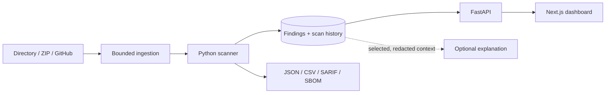

# SentriCode

[](https://github.com/mjumair7/sentricode-security-workbench/actions/workflows/ci.yml)
[](https://www.python.org/)
[](LICENSE)

SentriCode is a local security workbench I built to understand what happens between a source-code scan and a useful engineering decision.

The idea came from a security talk at Elevate (Nrth). I was interested in a practical question: once a scanner flags something, how do I keep the evidence, explain the risk, record a decision, and tell whether the same problem returns later?

This repository is my answer to that question. It combines a Python scanner and CLI with a small web dashboard. It is a student project and a learning tool—not a replacement for a professional security review.

## What it can do

- scan a local directory, uploaded ZIP, or public GitHub repository;
- find selected source-code risks, likely secrets, and sensitive logging patterns;
- inventory dependencies and export a CycloneDX SBOM;
- compare scans so recurring and resolved findings are visible;
- apply a policy threshold in CI;
- export JSON, CSV, SARIF, and SBOM reports;
- optionally request an AI explanation for one redacted finding.

The built-in checks work without an AI key or external scanner. Optional engines report whether they ran, failed, or were skipped, so a clean-looking report cannot silently imply coverage that was never performed.

## Quick start

Docker is the shortest path:

```sh
./scripts/configure
docker compose up -d --build
```

Save the owner token printed by the setup script, then open <http://127.0.0.1:8000>. Use **Try a sample** for a deliberately vulnerable demo or **New scan** for a project you are allowed to inspect.

Useful commands:

```sh
docker compose stop             # stop the app and keep saved reports
docker compose up -d            # start it again
docker compose logs -f app      # follow application logs
docker compose up -d --build    # rebuild after source changes
```

Do not run `docker compose down -v` unless deleting saved reports is intentional.

For a source installation on macOS or Linux:

```sh
./scripts/setup
./scripts/start
```

Python 3.11+ and Node.js 22 are required. Windows users can use Docker Desktop or WSL. More detail lives in [the development guide](docs/development.md).

## CLI

After running `./scripts/setup`, the same scanner can be used without the dashboard:

```sh
.venv/bin/sentricode scan /path/to/project
.venv/bin/sentricode scan /path/to/project --format json -o report.json
.venv/bin/sentricode scan /path/to/project --format sbom -o sbom.json
.venv/bin/sentricode scan /path/to/project --policy examples/policy.json
```

SentriCode never installs dependencies or runs code from the project being scanned.

## How the pieces fit



The main folders are:

```text
backend/sentricode/   scanner, API, worker, CLI, exports
frontend/             Next.js dashboard
tests/                API, scanner, ingestion, and export tests
scripts/              setup, configuration, and launch helpers
docs/                 architecture, coverage, security, CI, deployment
examples/             sample policy and deliberately vulnerable project
```

## Decisions I care about

- **Local first.** Reports and uploaded source stay on the machine unless an optional integration is deliberately enabled.
- **Bounded input.** Archives, repositories, files, and decoded text all have independent size limits.
- **Visible coverage.** Every engine records completed, skipped, or failed status.
- **No automatic fixes.** A finding or AI explanation cannot suppress results or patch a repository.
- **Single owner for now.** Authentication and storage are intentionally simpler than a multi-tenant service.

[Design notes](docs/design-notes.md) records the reasoning and rough edges behind those choices. [Coverage and limitations](docs/coverage.md) maps what is implemented and what is not.

## Tests

```sh
make test    # Python test suite
make check   # Python tests + frontend type checking
```

GitHub Actions runs the checks on pushes and pull requests. The reusable security workflow can also scan another repository against a checked-in baseline; see [CI integration](docs/ci.md).

## Honest limitations

- The static analysis is intentionally small and mostly intra-file. It is not CodeQL, Semgrep, or a full data-flow engine.
- Dependency inventory is not the same as complete vulnerability coverage.
- A clean result means only that the enabled checks did not report a match.
- GitHub importing and external enrichment require network access and should be treated as explicit trust decisions.
- The current application is designed for one owner, not a public multi-user deployment.

Those limits are part of the interface and documentation because false confidence is worse than an incomplete tool.

## What I learned

The most interesting part was not writing another regex. It was designing the boundaries around untrusted input: refusing unsafe ZIP entries, redacting secret evidence, keeping optional network calls separate, and making partial scanner coverage visible. The project also forced me to connect backend security decisions to UI language—an engine failure has to be obvious to the person reading the report.

## License and security reports

SentriCode is MIT licensed. Please use [SECURITY.md](SECURITY.md) for responsible disclosure.

The project is not affiliated with Capital One or Elevate; the talk was simply the starting point for my own implementation.
